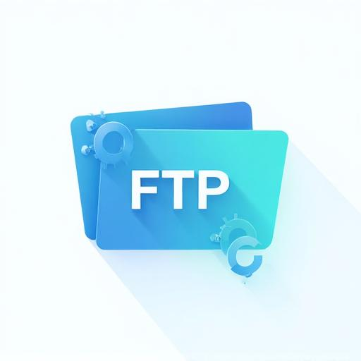

# WebFTP

<div align="center">
  
  <br /><br />
  <strong>A modern, browser-based file manager for FTP, FTPS, SFTP, SMB, WebDAV and local servers.</strong>
  <br /><br />

  
  
  
  
</div>

---

## Overview

WebFTP is an open-source, web-based file manager that lets you connect to remote servers directly from your browser — no desktop client, no installation. It supports multiple transfer protocols, an inline code editor with syntax highlighting, a drag-and-drop upload system, a fully customizable theming engine, and more.

Built with React, TypeScript, Vite, Tailwind CSS, CodeMirror, and backed by Supabase for authentication and saved connections.

---

## Features

### File Management
- Browse, navigate and manage files and folders on remote servers
- Create, rename, move, delete files and folders
- Drag and drop files between folders to move them
- Drag and drop files from your desktop to upload them
- Download files and folders as ZIP, TAR, or 7Z archives
- List view and Grid view modes
- File properties panel (size, permissions, modified date)
- Right-click context menus on files and on the background

### Transfer System
- Real-time transfer queue with progress tracking
- Pause, resume, and cancel individual transfers
- Concurrent transfer support (configurable)
- Auto-retry on failure (configurable)
- Configurable buffer size, connection timeout, and keep-alive interval

### Code Editor
- Inline file editing powered by CodeMirror 6
- Syntax highlighting for 30+ languages: JavaScript, TypeScript, JSX/TSX, Python, Go, Java, C#, Rust, Ruby, PHP, Kotlin, Swift, HTML, CSS, SCSS, SQL, Markdown, YAML, TOML, JSON, Dockerfile, Shell, Nginx config, Makefile, and more
- Markdown preview mode
- Save files directly back to the server

### Authentication & Accounts
- Sign up and sign in via Supabase Auth
- Email verification on sign-up
- Username and avatar customization
- Saved connections tied to your account
- Recent connections history (for guests, scoped by IP)
- Guest mode — connect without an account

### Bookmarks
- Save frequently used server paths as bookmarks
- Quickly navigate to bookmarked directories

### Theming System
- 15 built-in color presets (Blue, Purple, Green, Red, Orange, Teal, Pink, Cyan, Indigo, Amber, Emerald, Rose, Violet, Sky, Fuchsia)
- Custom color picker — pick any hex color and the UI adapts automatically
- Material You-style dynamic theming: backgrounds, cards, sidebar, and borders all tint to match the primary color
- Light and Dark mode with a manual toggle
- AMOLED / true-black dark mode option
- System theme detection (auto-follows OS preference)
- All theme settings are persisted across sessions in localStorage

### Protocols Supported

| Protocol | Description |
|----------|-------------|
| FTP | Standard File Transfer Protocol |
| FTPS | FTP over TLS/SSL |
| SFTP | SSH File Transfer Protocol with SSH key support |
| SMB | Windows/Samba network shares |
| WebDAV | Web Distributed Authoring and Versioning |
| Local | Local filesystem browsing |

> **Note:** The current release uses an in-memory virtual filesystem for demo/preview purposes. Real protocol backends (FTP, SFTP, SMB, WebDAV) require a backend proxy server. See [CONTRIBUTING.md](CONTRIBUTING.md) for architecture details and the roadmap for real implementations.

### Miscellaneous
- Easter egg hidden somewhere in the interface 🥚
- Mobile-responsive layout
- Keyboard-accessible UI throughout

---

## Tech Stack

| Layer | Technology |
|-------|------------|
| Frontend framework | React 18 + TypeScript |
| Build tool | Vite |
| Styling | Tailwind CSS + CSS custom properties (HSL design tokens) |
| UI components | shadcn/ui (Radix UI primitives) |
| Code editor | CodeMirror 6 via @uiw/react-codemirror |
| Auth, DB & Storage | Supabase (PostgreSQL + GoTrue Auth + S3-compatible storage) |
| State / data fetching | TanStack Query v5 |
| Forms | react-hook-form + zod |
| Routing | React Router v6 |
| Architecture | MVP (Model–View–Presenter) pattern |

---

## Getting Started

### Prerequisites
- Node.js 18+ and npm

### Local development

```bash
# Clone the repo
git clone https://github.com/Hexadecinull/WebFTP.git
cd WebFTP

# Install dependencies
npm install

# Copy the environment file and fill in your Supabase credentials
cp .env.example .env

# Start the dev server
npm run dev
```

The app will be available at `http://localhost:8080`.

### Environment variables

Create a `.env` file at the root with:

```env
VITE_SUPABASE_URL=https://your-project.supabase.co
VITE_SUPABASE_PUBLISHABLE_KEY=your-anon-key
VITE_SUPABASE_PROJECT_ID=your-project-id
```

You can find all three values in your Supabase project under **Project Settings → API**.

---

## Deployment

### Deploying to a self-hosted server (recommended)

WebFTP is designed to run on your own server. The server acts as both the web host for the frontend and the proxy for real protocol connections (FTP, FTPS, SFTP, SSH, SCP, WebDAV). This is the only way to get real connections working — browsers cannot open raw TCP sockets.

#### Architecture

```
Browser → webftp.ssmg4.dpdns.org (Nginx, serves the built frontend)
                    ↓
         Node.js proxy server (server/, port 3001)
                    ↓
         Remote FTP / SFTP / SSH / WebDAV servers
```

Cloudflare sits in front of the domain and handles HTTPS termination and DDoS protection.

#### Step 1 — Server prerequisites

On your server, install:
- Node.js 18+ (`sudo apt install nodejs npm` or use `nvm`)
- Nginx (`sudo apt install nginx`)
- Git (`sudo apt install git`)
- pm2 for process management (`npm install -g pm2`)

#### Step 2 — Clone and build the frontend

```bash
git clone https://github.com/Hexadecinull/WebFTP.git /var/www/webftp
cd /var/www/webftp
bun install
bun run build
# The built frontend is now in /var/www/webftp/dist
```

#### Step 3 — Set up the proxy server

```bash
cd /var/www/webftp/server
npm install
# Create a .env file
echo "PORT=3001" > .env
echo "ALLOWED_ORIGIN=https://webftp.ssmg4.dpdns.org" >> .env
# Start with pm2 so it survives reboots
pm2 start index.js --name webftp-proxy
pm2 save
pm2 startup
```

#### Step 4 — Configure Nginx

Create `/etc/nginx/sites-available/webftp`:

```nginx
server {
    listen 80;
    server_name webftp.ssmg4.dpdns.org;

    root /var/www/webftp/dist;
    index index.html;

    # Serve the frontend — fall back to index.html for React Router
    location / {
        try_files $uri $uri/ /index.html;
    }

    # Proxy API requests to the Node.js server
    location /api/ {
        proxy_pass http://localhost:3001;
        proxy_http_version 1.1;
        proxy_set_header Upgrade $http_upgrade;
        proxy_set_header Connection 'upgrade';
        proxy_set_header Host $host;
        proxy_cache_bypass $http_upgrade;
    }
}
```

```bash
ln -s /etc/nginx/sites-available/webftp /etc/nginx/sites-enabled/
nginx -t && systemctl reload nginx
```

Cloudflare handles HTTPS — set your SSL/TLS mode to **Full** in the Cloudflare dashboard.

#### Step 5 — Add GitHub Secrets

In your GitHub repo go to **Settings → Secrets and variables → Actions** and add:

| Secret name | Value |
|-------------|-------|
| `VITE_SUPABASE_URL` | Your Supabase project URL |
| `VITE_SUPABASE_PUBLISHABLE_KEY` | Your Supabase anon/public key |
| `VITE_SUPABASE_PROJECT_ID` | Your Supabase project ID |
| `DEPLOY_PATH` | Absolute path to the web root on your server (e.g. `/var/www/webftp/dist`) |

#### Step 6 — Set up the self-hosted GitHub Actions runner

The deploy workflow uses a self-hosted runner on your server to copy the built frontend without needing FTP or SSH credentials in secrets.

1. In your GitHub repo go to **Settings → Actions → Runners → New self-hosted runner**
2. Follow the instructions for Linux to download and configure the runner on your server
3. Run it as a service: `sudo ./svc.sh install && sudo ./svc.sh start`

Once the runner is online, every push to `main` will:
1. Build the app on GitHub's infrastructure with your Supabase secrets
2. Upload the built `dist/` as a GitHub Actions artifact
3. Your self-hosted runner downloads the artifact and `rsync`s it to `DEPLOY_PATH`

#### Step 7 — Configure Supabase redirect URLs

In your Supabase project under **Authentication → URL Configuration**:
- **Site URL**: `https://webftp.ssmg4.dpdns.org`
- **Redirect URLs**: add `https://webftp.ssmg4.dpdns.org/**`

---

## Supabase Setup

If you're setting up a fresh Supabase project, run the included migrations with the Supabase CLI:

```bash
supabase login
supabase link --project-ref your-project-id
supabase db push
```

The migrations in `supabase/migrations/` create the `profiles` table and the `avatars` storage bucket with the correct Row Level Security policies.

---

## CI / CD

Two GitHub Actions workflows are included out of the box:

**`ci.yml`** — runs on every push and pull request (GitHub-hosted runner):
- ESLint
- TypeScript type check (`tsc --noEmit`)
- Production build

**`deploy.yml`** — runs on every push to `main`:
- GitHub-hosted runner: builds the app with Supabase secrets, uploads `dist/` as an artifact
- Self-hosted runner (your server): downloads the artifact and `rsync`s it to the web root

---

## Contributing

Contributions are very welcome! Please read [CONTRIBUTING.md](CONTRIBUTING.md) for guidelines on getting involved, the project architecture, coding style, and the roadmap for implementing real protocol backends.

---

## License

WebFTP is licensed under the **GNU General Public License v3.0**.  
See the [LICENSE](LICENSE) file for the full license text.

You are free to use, modify, and distribute this software under the terms of the GPL-3.0. Any derivative work must also be distributed under the same license.
